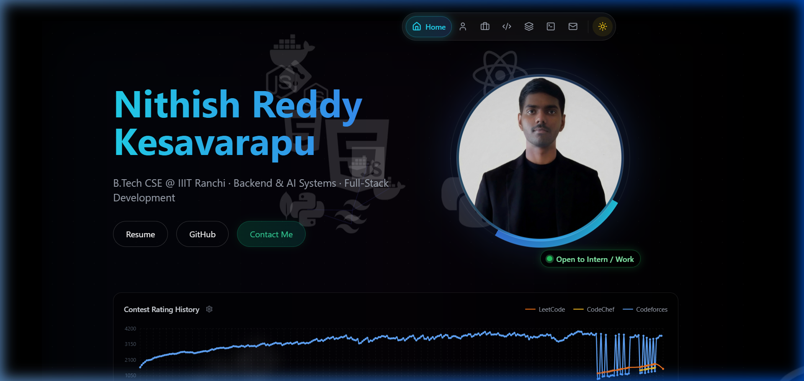
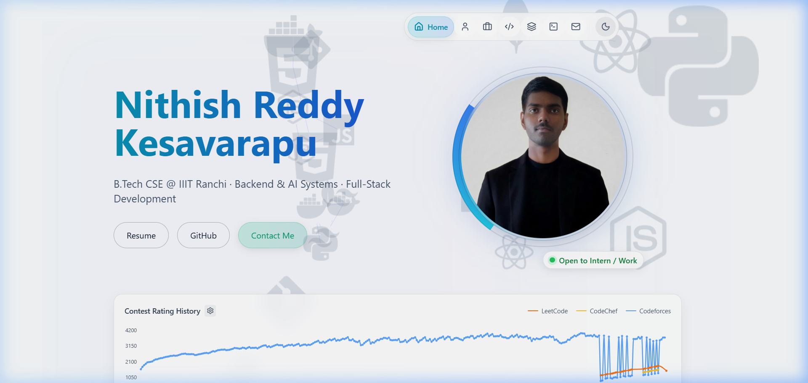
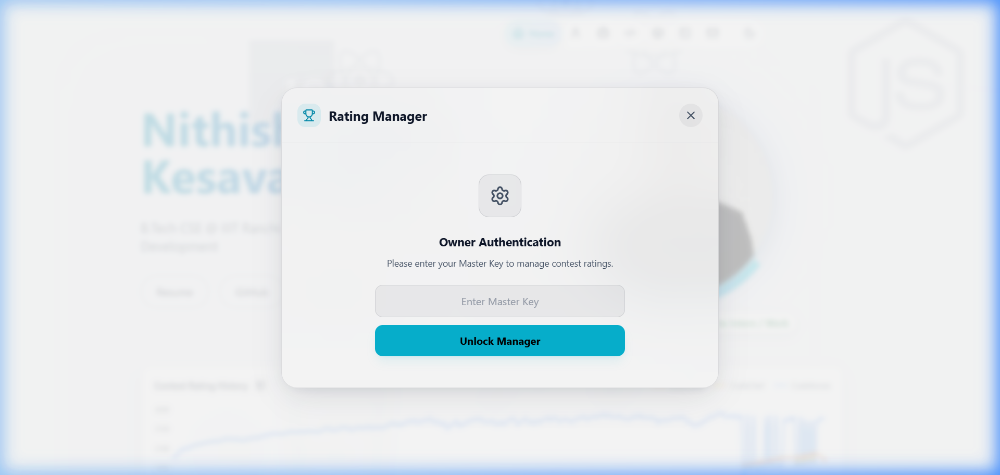
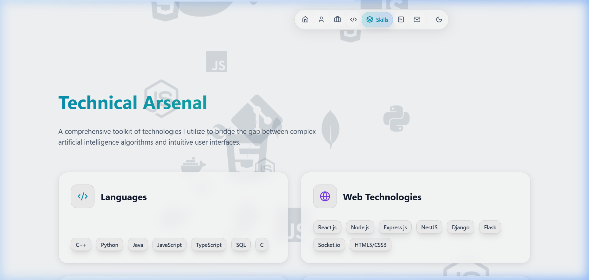

# 🚀 Nithish Reddy Kesavarapu | Portfolio

A high-performance, visually stunning developer portfolio featuring an interactive neural network background, dynamic theme switching, and automated multi-platform contest rating synchronization.

## 🖼️ Visual Showcase

| **Glass-Dark Mode** | **Pristine-Light Mode** |
|:---:|:---:|
|  |  |

### 🛠️ Key Modules
| **Contest Manager** | **Technical Arsenal** |
|:---:|:---:|
|  |  |

## ✨ Implementation Deep-Dive

### 🧠 1. Interactive Neural Architecture
The background isn't just a static video; it's a real-time **Three.js** simulation.
- **Node-Link System**: 100+ dynamic particles (nodes) connected by adaptive lines.
- **Icon Integration**: Technology icons are dynamically loaded as 3D sprites and mapped to specific nodes.
- **Fluid Response**: Uses custom mouse-tracking logic to repel/attract connections, creating a "living" network feel.

### 📈 2. Synchronized Contest Ecosystem
A custom-built engine to bridge the gap between competitive programming and professional presentation.
- **API Integration**: Connects to community-driven APIs for **LeetCode** and **CodeChef**, and the official **Codeforces** API.
- **Fallback Logic**: Implements a robust "Manual Override" for situations where APIs might be rate-limited, allowing for accurate rating display.
- **Secured Dashboard**: The `ContestManager` sub-app is secured with a passcode (stored in `.env`), giving the owner a private interface to push updates.

### 🌓 3. Fluid Theme Synergy
Designed for maximum readability in any environment.
- **Atomic Variables**: Uses CSS utility variables (`--bg`, `--text`) that swap values instantly during a theme toggle.
- **Transition Smoothing**: Implemented a 0.5s cubic-bezier transition across the entire DOM to prevent flickering and provide a premium "fade" effect.
- **Visual Inversion**: Not just colors, but background glows and orbital speeds are adjusted to maintain visual balance across themes.

## 🛠️ Tech Stack

-   **Core**: [React 18](https://reactjs.org/) + [Vite](https://vitejs.dev/)
-   **Styling**: [Tailwind CSS](https://tailwindcss.com/)
-   **Visuals & 3D**: [Three.js](https://threejs.org/)
-   **Animations**: [Framer Motion](https://www.framer.com/motion/)
-   **Data Viz**: [Recharts](https://recharts.org/)
-   **Icons**: [Lucide React](https://lucide.dev/)
-   **Form Handling**: [Web3Forms](https://web3forms.com/)

## 🏗️ Getting Started

### Prerequisites
- [Node.js](https://nodejs.org/) (v16.0 or higher)
- npm or yarn

### Installation

1. **Clone the Repository**
   ```bash
   git clone https://github.com/nithishkesavarapu-code/Portfolio.git
   cd Portfolio
   ```

2. **Install Dependencies**
   ```bash
   npm install
   ```

3. **Environment Setup**
   Create a `.env` file in the root directory:
   ```env
   VITE_PASSCODE=your_master_key
   VITE_WEB3FORMS_KEY=your_web3forms_access_key
   ```

4. **Run Locally**
   ```bash
   npm run dev
   ```

---
Built with ❤️ by [Nithish Reddy Kesavarapu](https://www.linkedin.com/in/nithish-reddy-kesavarapu/)
